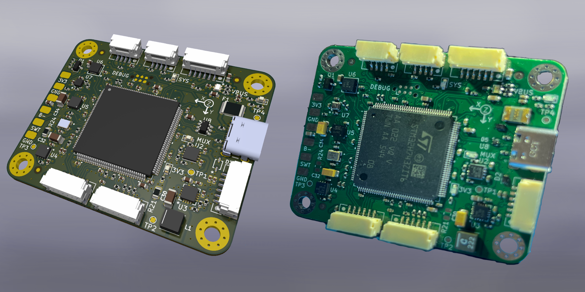

<!--
This project follows atomic documentation.
Each subsystem is documented independently.
All configs are stored in YAML.
-->

# Shirley - Flight Controller Development Board



Shirley is high-performance flight controller hardware platform built around the STM32H743 microcontroller, designed for custom firmware development and compatibility with existing flight stacks.

## Features

### Core Hardware
- **MCU**: STM32H743ZIT6 (480 MHz Cortex-M7, FPU, DSP)
- **IMU**: ICM-40609-D (6-axis, low-noise, up to 32 kHz ODR)
- **Magnetometer**: MMC5983MA (18-bit precision with degaussing)
- **Barometer**: BMP390 High-precision altitude sensing
- **Storage**: SD card socket for flight data logging

### Power System
- **Input**: 5V via standard Pixhawk power module
- **Architecture**: 5V MUX + Dual 3.3V rails (digital + filtered analog) for low-noise sensor operation
- **Protection**: ESD protection on USB-C and power connector

### Connectivity
- **Motor Control**: 4x ESC outputs
- **RC Input**: Standard RC receiver connection
- **GPS**: Dedicated UART interface
- **Telemetry**: Bidirectional radio module support
- **USB**: Full-speed OTG for configuration and debugging
- **CAN**: FDCAN interface (in the GPS connector)
- **Debug**: Tag-Connect SWD/SWO interface

Note: All connectors are GH1.25 connectors

## Documentation

This project uses atomic documentation - each subsystem is documented independently in `/docs`:

- **[Hardware Overview](docs/hardware/overview.md)** - System architecture and block diagrams
- **[Power Architecture](docs/hardware/power-architecture.md)** - Power rail design and specifications
- **[Design Decisions](docs/hardware/design-decisions.md)** - Component selection rationale
- **[STM32 Subsystem](docs/hardware/stm32-subsystem/)** - MCU peripheral configuration

All hardware configurations are defined in machine-readable YAML format in `/config`:
- **[pinout.yaml](config/pinout.yaml)** - Complete STM32H743 pin assignments
- **[power.yaml](config/power.yaml)** - Power rail specifications and architecture

## Repository Structure

```
├── hardware/KiCad/FC_v1.0/         # KiCad 9.0 schematics and PCB layout
├── firmware/STM32 Cube IDE/        # STM32CubeMX configuration
├── config/                         # YAML configuration files
├── docs/                           # Atomic documentation by subsystem
├── docs/hardware/exports/          # exports and version history
└── resources/datasheets/           # Component datasheets organized by type
```

## Getting Started

### Overview
1. Exported schematics and renders can be found here: `exports/`
2. The different versions designed and produced are detailed here: `exports/versions-history.md`
3. An overview of the design can be found here: `docs/hardware/overview.md`

### Hardware Design
1. Open schematics in **KiCad 9.0**: `hardware/KiCad/FC_v1.0/FC-proto.kicad_sch`
2. Review hierarchical subsystem sheets (power, interfaces, sensors)
3. Custom component footprints are in `hardware/cad-layout/`

### Firmware Development
1. Open STM32CubeMX project: `firmware/STM32 Cube IDE/FC-proto-El.ioc`
2. Pin assignments match `config/pinout.yaml`
3. Connect debugger via Tag-Connect cable (SWD: PA13/PA14, SWO: PB3)

## Design Philosophy

This first revision prototype prioritizes:
- **Development-friendly**: Easy debugging via Tag-Connect, USB, and comprehensive logging
- **Compact Board**: Compact board to fit in smaller frames
- **Signal quality**: Low-noise analog power domain for sensor accuracy
- **Integration**: Integration with existing pixhawk drone hardware

## Flight Stack Compatibility

The hardware pinout and peripheral configuration supports:
- **PX4** - Full feature compatibility
- **Ardupilot** - Standard Pixhawk interface support
- **Betaflight** - High-rate control loop capability


