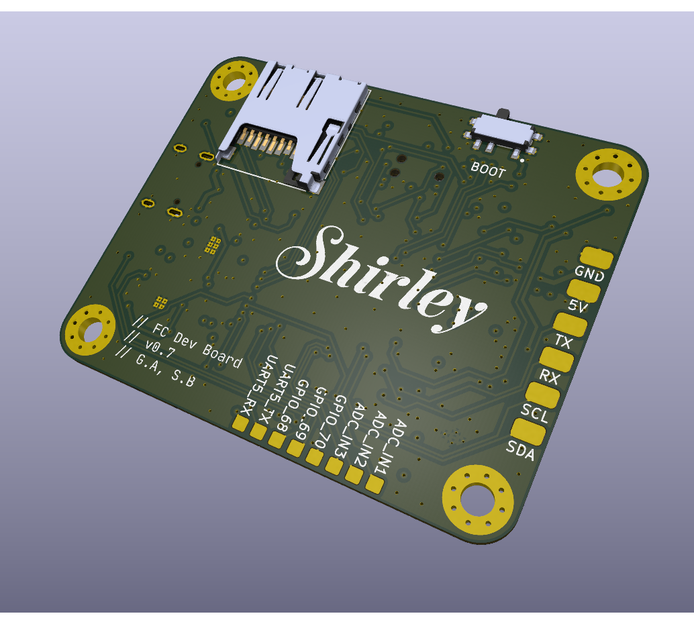

# Version History

This file present the different version of the board that have been designed. It also reports wich version has been manufactured.

## Current version information:

- name : ***Shirley***
- descriptive name : **FC Dev Board**
- version number: **0.7**
- **[Schematic exported](FC-Dev-Board-v0.7-Schem.pdf)**
- Manufactured : planned
- Tested : planned

## Past versions:

- v0.5:
[Schematic exported](past-versions/FC_Schem_v0.5.pdf)
- v0.3:
[Schematic exported](past-versions/FC_Schem_v0.3.pdf)
Note : Use the ICM-42688-P IMU 

---