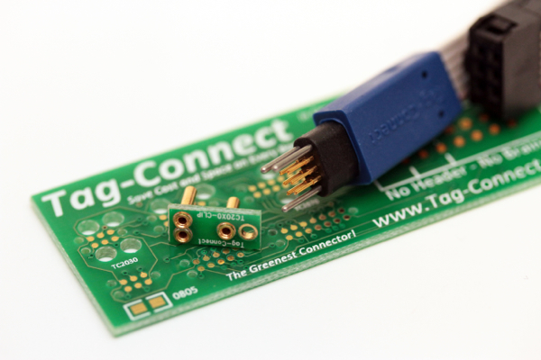

# Hardware Overview

## System Architecture

Shirley is a high-performance flight controller development board built around the **STM32H743ZIT6** microcontroller (480 MHz Cortex-M7 with FPU and DSP). The hardware architecture prioritizes signal quality, compact design, and seamless integration with existing Pixhawk drone hardware.

## Core Components

### Microcontroller
- **STM32H743ZIT6**: 480 MHz Cortex-M7, 2 MB Flash, 1 MB RAM
- Complete peripheral assignments in [`config/pinout.yaml`](../../config/pinout.yaml)
- HSE: 16 MHz external crystal oscillator

### Embedded Sensors
- **ICM-40609-D** (IMU): 6-axis low-noise sensor, up to 32 kHz ODR, SPI5 interface
- **MMC5983MA** (Magnetometer): 18-bit precision with built-in degaussing, SPI4 interface
- **BMP390** (Barometer): High-precision altitude sensor, I2C2 interface

See [`docs/hardware/design-decisions.md`](design-decisions.md) for sensor selection rationale.

### Storage
- **SD Card**: SDMMC1 interface (4-bit mode) for flight data logging

## Power Architecture

The power system uses a hierarchical rail structure optimized for low-noise sensor operation:

```
Pixhawk Power Module (5V, 2-3A)
  ├─ EXT_5V → External peripherals (GPS, telemetry) - bypasses MUX
  └─ TPS2113A MUX → 5V_SYS (2.5A, onboard only)
       ├─ TPS62130 Buck → 3V3_DIG (2A) → STM32, peripherals, interfaces
       └─ TPS7A2133 LDO → 3V3_ANA (500mA) → Sensors, STM32 VDDA
```

**Key Design Features:**
- **Dual 3.3V rails**: Separate digital (buck) and analog (LDO) domains
- **5V Power MUX**: The MCU and onboard sensors can be supplied by USB-C, Power connector or both
- **External peripheral bypass**: GPS and telemetry connect directly to EXT_5V, preserving 5V_SYS budget for onboard systems
- **Ultra-low-noise analog**: TPS7A2133 LDO provides 7.7µVRMS noise for precision sensors

Full specifications in [`config/power.yaml`](../../config/power.yaml).

## Peripheral Interfaces

### Power Connector (JST GH 6-pin)
- **Connector**: SM06B-GHS-TB
- **EXT_5V**: Primary power input from Pixhawk power module (5.0V, 2-3A)
- **Battery Monitoring**: Voltage sense (ADC1_INP2: PF11), Current sense (ADC1_INP3: PA6)
- Powers external peripherals directly (GPS, telemetry bypass MUX)

### USB Type-C
- **Interface**: USB_OTG_FS (Full Speed)
- **Pins**: DM: PA11, DP: PA12, VBUS: PA9
- Secondary power input for development/testing

### Debug Tag Connect (TC2030)
- **Interface**: SWD programming and debugging
- **Pins**: SWDIO: PA13, SWCLK: PA14, SWO: PB3
- Tag-Connect 6-pin no-legs connector for compact debugging

### RC Connector (JST GH)
- **Interface**: USART6
- **Pins**: TX: PC6, RX: PC7
- RC receiver input (SBUS, PPM, etc.)

### ESC Connector (JST GH)
- **Interface**: TIM1 (4 channels)
- **Pins**: CH1: PE9, CH2: PE11, CH3: PE13, CH4: PE14
- Motor outputs supporting PWM and DShot protocols

### Telemetry Connector (JST GH)
- **Interface**: UART4 with hardware flow control
- **Pins**: TX: PA0, RX: PA1, CTS: PB0, RTS: PB14
- Telemetry radio communication

### GPS Connector (JST GH)
- **Interfaces**: UART8 + FDCAN1
- **UART8 Pins**: TX: PE1, RX: PE0
- **FDCAN1 Pins**: TX: PB9, RX: PD0
- Supports both serial and CAN GPS modules

### I2C Connector (JST GH)
- **Interface**: I2C1
- **Pins**: SDA: PB7, SCL: PB6
- External I2C peripherals (e.g., external compass)

### Extra Pad Connectors
- **UART5**: TX: PB13, RX: PB12 (Mini Pad Out)
- **USART2**: TX: PA2, RX: PA3 (Pad Out)
- **I2C4**: SDA: PF15, SCL: PF14 (Pad Out)
- **ADC2**: INP2: PF13, INP4: PC4, INP5: PB1 (Analog inputs)
- **GPIOs**: PE15, PB10, PB11 (General purpose expansion)


Complete pin assignments in [`config/pinout.yaml`](../../config/pinout.yaml).

## Connectivity Standards

All connectors use **JST GH 1.25mm** standard (except for debug) for Pixhawk compatibility:
- Power: SM06B-GHS-TB (6-pin)
- Peripherals: Various GH connectors
- Debug: TC2030 (Tag-Connect 6 Pin)



## Design Priorities

This first revision prototype focuses on:
1. **Signal quality**: Clean analog power domain for sensor accuracy
2. **Development-friendly**: Tag-Connect debugging, USB access, comprehensive logging
3. **Compact form factor**: Fits smaller drone frames
4. **Pixhawk integration**: Standard interfaces and connectors

## Flight Stack Compatibility

The hardware supports multiple flight stacks:
- **PX4**: Full feature compatibility
- **ArduPilot**: Standard Pixhawk interface support
- **Betaflight**: High-rate control loop capability

## Related Documentation

- **[Power Architecture](power-architecture.md)**: Detailed power subsystem design
- **[Design Decisions](design-decisions.md)**: Component selection rationale
- **[STM32 Subsystem](stm32-subsystem/)**: MCU peripheral configuration
- **Configuration Files**: [`pinout.yaml`](../../config/pinout.yaml), [`power.yaml`](../../config/power.yaml)
